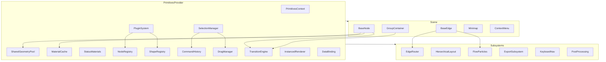

# Design Document: production-grade-primitives

## Overview

`@verdant/primitives` v2.0 is a complete architectural upgrade of the core 3D rendering library for the Verdant diagram system. The current v1 library is a thin wrapper around React Three Fiber with 6 shapes, a module-singleton registry, no geometry sharing, and no interaction beyond hover/click. v2.0 transforms it into a production-grade primitive layer capable of rendering 200+ node diagrams at 60 fps with full interactivity, accessibility, animation, and extensibility.

The upgrade is organized into a "Fix Now" phase (critical memory leaks) followed by five sprints. The design preserves backward compatibility for the `NodeProps` and `EdgeLineProps` interfaces while introducing new subsystems as opt-in capabilities through a React context provider (`PrimitivesProvider`).

### Key Design Decisions

- **Provider-scoped state**: All subsystem instances (registries, caches, history, selection) live inside a `PrimitivesProvider` React context rather than module singletons. This enables multiple independent diagram instances per page and proper cleanup on unmount.
- **Subsystem composition**: Each capability (geometry pooling, material caching, animation, selection, etc.) is an independent class with a well-defined interface. Components consume subsystems via hooks (`useGeometryPool`, `useMaterialCache`, etc.).
- **Incremental adoption**: Existing node components in `@verdant/nodes` continue to work without modification. New features are additive props.
- **Three.js object lifecycle**: All Three.js objects (geometries, materials, textures) are owned by their respective cache/pool subsystem and disposed through reference counting. Components never call `.dispose()` directly.

---

## Architecture



### Package Structure (v2.0)

```
packages/primitives/src/
├── provider/
│   ├── PrimitivesProvider.tsx      # Root context provider
│   ├── PrimitivesContext.ts        # Context type + hook
│   └── PrimitivesConfig.ts        # Configuration types
├── geometry/
│   ├── SharedGeometryPool.ts
│   ├── GeometryFactory.ts
│   └── LODManager.ts
├── materials/
│   ├── MaterialCache.ts
│   ├── StatusMaterials.ts
│   └── AnimatedMaterial.ts
├── shapes/
│   ├── index.ts
│   ├── ShapeDefinition.ts
│   ├── CompoundShape.tsx
│   ├── CustomShape.tsx
│   └── [20+ shape files]
├── nodes/
│   ├── BaseNode.tsx                # Upgraded (backward-compat)
│   ├── NodePorts.tsx
│   ├── NodeBadge.tsx
│   ├── NodeStatus.ts
│   ├── NodeLabel.tsx
│   └── NodeInteraction.ts
├── edges/
│   ├── BaseEdge.tsx                # Upgraded (backward-compat)
│   ├── EdgeRouter.ts
│   ├── FlowParticles.tsx
│   ├── EdgeLabel.tsx
│   └── EdgePorts.ts
├── groups/
│   ├── GroupContainer.tsx
│   ├── GroupCollapse.tsx
│   └── NestedGroup.tsx
├── animation/
│   ├── TransitionEngine.ts
│   ├── EnterExit.ts
│   ├── LayoutTransition.ts
│   └── Timeline.ts
├── interaction/
│   ├── SelectionManager.ts
│   ├── DragManager.ts
│   ├── CommandHistory.ts
│   ├── ContextMenu.tsx
│   └── KeyboardNav.ts
├── registry/
│   ├── NodeRegistry.ts
│   ├── ShapeRegistry.ts
│   └── PluginSystem.ts
├── performance/
│   ├── InstancedRenderer.tsx
│   ├── FrustumCulling.ts
│   ├── LODController.ts
│   └── ObjectPool.ts
├── export/
│   ├── PNGExport.ts
│   ├── SVGExport.ts
│   └── GLTFExport.ts
├── minimap/
│   └── Minimap.tsx
├── postprocessing/
│   └── PostProcessingPipeline.tsx
├── databinding/
│   └── DataBinding.ts
├── types.ts
└── index.ts
```

---

## Components and Interfaces

### PrimitivesProvider

The root provider that initializes all subsystem instances and makes them available via React context.

```typescript
interface PrimitivesConfig {
  maxUndoHistory?: number;           // default: 100
  statusColors?: StatusColorConfig;
  postProcessing?: PostProcessingConfig;
  minimap?: MinimapConfig;
  plugins?: VerdantPlugin[];
}

function PrimitivesProvider(props: {
  config?: PrimitivesConfig;
  children: React.ReactNode;
}): JSX.Element
```

### SharedGeometryPool

Reference-counted cache for Three.js geometry instances.

```typescript
interface GeometryPoolStats {
  cachedCount: number;
  totalReferenceCount: number;
}

class SharedGeometryPool {
  acquire(key: string, factory: () => THREE.BufferGeometry): THREE.BufferGeometry
  release(key: string): void
  getStats(): GeometryPoolStats
  dispose(): void
}
```

The geometry key is a deterministic string: `{shapeName}:{param1}:{param2}:...` (e.g. `"sphere:0.7:32:32"`).

### MaterialCache

Reference-counted cache for Three.js material instances, keyed by a deterministic config hash.

```typescript
class MaterialCache {
  acquire(config: MaterialConfig): THREE.Material
  release(config: MaterialConfig): void
  dispose(): void
}

interface MaterialConfig {
  color: string;
  opacity?: number;
  emissive?: string;
  emissiveIntensity?: number;
  metalness?: number;
  roughness?: number;
}
```

The cache key is derived by `JSON.stringify(config, Object.keys(config).sort())`.

### ShapeDefinition

Declarative descriptor for a shape's geometry, ports, and metadata.

```typescript
interface NodePort {
  name: string;
  localPosition: THREE.Vector3;
  facingDirection: THREE.Vector3;
}

interface ShapeDefinition {
  name: string;
  geometryFactory: (params?: Record<string, number>) => THREE.BufferGeometry;
  defaultPorts: NodePort[];
  defaultMaterialConfig: MaterialConfig;
  lodVariants?: Array<{
    maxScreenPixels: number;
    geometryFactory: () => THREE.BufferGeometry;
  }>;
}
```

### BaseNode (v2)

Backward-compatible upgrade. All new props are optional.

```typescript
interface NodeProps {
  // v1 props (unchanged)
  label: string;
  position: [number, number, number];
  selected?: boolean;
  hovered?: boolean;
  color?: string;
  size?: string;
  glow?: boolean;
  onClick?: (e: ThreeEvent<MouseEvent>) => void;
  onPointerOver?: (e: ThreeEvent<PointerEvent>) => void;
  onPointerOut?: (e: ThreeEvent<PointerEvent>) => void;
  // v2 additions
  id?: string;
  status?: NodeStatus;
  badges?: NodeBadge[];
  shape?: string;
  enterAnimation?: AnimationType;
  exitAnimation?: AnimationType;
  animationDuration?: number;
  ports?: NodePort[];
  bindings?: DataBindingConfig;
}

type NodeStatus = 'healthy' | 'warning' | 'error' | 'unknown';
type AnimationType = 'fade' | 'scale' | 'slide';
```

### BaseEdge (v2)

```typescript
interface EdgeLineProps {
  // v1 props (unchanged)
  from: [number, number, number];
  to: [number, number, number];
  label?: string;
  animated?: boolean;
  style?: string;
  color?: string;
  width?: number;
  // v2 additions
  id?: string;
  fromNodeId?: string;
  toNodeId?: string;
  fromPort?: string;
  toPort?: string;
  routing?: 'straight' | 'curved' | 'orthogonal';
  flowParticles?: FlowParticleConfig;
}
```

### SelectionManager

```typescript
class SelectionManager extends EventEmitter {
  selectedIds: ReadonlySet<string>
  select(id: string, additive?: boolean): void
  deselect(id: string): void
  clearSelection(): void
  selectBox(bounds: THREE.Box3, nodeRegistry: Map<string, THREE.Box3>): void
  on('selectionChange', handler: (ids: Set<string>) => void): void
}
```

### CommandHistory

```typescript
interface Command {
  execute(): void;
  undo(): void;
  description?: string;
}

class CommandHistory {
  canUndo: boolean
  canRedo: boolean
  push(command: Command): void
  undo(): void
  redo(): void
  clear(): void
}
```

### PluginSystem

```typescript
interface VerdantPlugin {
  name: string;
  version: string;
  install(registry: PluginRegistry): void;
}

interface PluginRegistry {
  registerNode(type: string, component: React.ComponentType<any>, options?: NodeRegistrationOptions): void;
  registerShape(name: string, definition: ShapeDefinition): void;
  registerContextAction(elementType: 'node' | 'edge', action: ContextAction): void;
}

class PluginSystem {
  install(plugin: VerdantPlugin): void
  listPlugins(): Array<{ name: string; version: string }>
}
```

### EdgeRouter

```typescript
type RoutingAlgorithm = 'straight' | 'curved' | 'orthogonal';

class EdgeRouter {
  computePath(
    from: THREE.Vector3,
    to: THREE.Vector3,
    algorithm: RoutingAlgorithm,
    obstacles?: THREE.Box3[]
  ): THREE.Vector3[]
}
```

### TransitionEngine

```typescript
class TransitionEngine {
  playEnter(nodeId: string, type: AnimationType, duration: number): Promise<void>
  playExit(nodeId: string, type: AnimationType, duration: number): Promise<void>
  playLayoutTransition(positions: Map<string, THREE.Vector3>, duration: number): Promise<void>
}
```

### DataBinding

```typescript
interface BindingConfig {
  nodeId: string;
  property: 'status' | 'label' | 'color' | 'badges';
  source: Observable<any>;
}

class DataBinding {
  bind(config: BindingConfig): void
  unbind(nodeId: string, property?: string): void
  dispose(): void
}
```

---

## Data Models

### Geometry Key

The `SharedGeometryPool` uses a deterministic string key to identify unique geometry instances:

```
{shapeName}:{param1}:{param2}:...
// e.g. "sphere:0.7:32:32" or "box:1:1:1"
```

### Material Config Key

The `MaterialCache` derives a cache key by JSON-serializing the `MaterialConfig` object with sorted keys:

```typescript
function materialKey(config: MaterialConfig): string {
  return JSON.stringify(config, Object.keys(config).sort());
}
```

### Command Object

```typescript
interface MoveCommand extends Command {
  type: 'move';
  nodeIds: string[];
  previousPositions: Map<string, THREE.Vector3>;
  nextPositions: Map<string, THREE.Vector3>;
}

interface AddNodeCommand extends Command {
  type: 'add-node';
  nodeId: string;
  nodeData: NodeData;
}

interface RemoveNodeCommand extends Command {
  type: 'remove-node';
  nodeId: string;
  nodeData: NodeData;
}
```

### ShapeRegistry Entry

```typescript
// Internal registry map
type ShapeRegistryMap = Map<string, ShapeDefinition>;

// Built-in shapes (14 total after Sprint 2)
const BUILTIN_SHAPES = [
  'cube', 'sphere', 'cylinder', 'diamond', 'hexagon', 'torus',  // v1
  'pentagon', 'octagon', 'ring', 'box', 'cone', 'capsule', 'icosahedron', 'plane'  // v2
];
```

### NodeBadge

```typescript
interface NodeBadge {
  position: 'top-right' | 'top-left' | 'bottom-right' | 'bottom-left';
  content: string;
  color?: string;
}
```

### FlowParticleConfig

```typescript
interface FlowParticleConfig {
  speed?: number;   // seconds per traversal, default 2.0
  count?: number;   // simultaneous particles, default 5
  color?: string;   // defaults to parent edge color
}
```

### PrimitivesContext Shape

```typescript
interface PrimitivesContextValue {
  geometryPool: SharedGeometryPool;
  materialCache: MaterialCache;
  statusMaterials: StatusMaterials;
  nodeRegistry: NodeRegistry;
  shapeRegistry: ShapeRegistry;
  pluginSystem: PluginSystem;
  commandHistory: CommandHistory;
  selectionManager: SelectionManager;
  dragManager: DragManager;
  transitionEngine: TransitionEngine;
  instancedRenderer: InstancedRenderer;
  dataBinding: DataBinding;
  config: PrimitivesConfig;
}
```


---

## Correctness Properties

*A property is a characteristic or behavior that should hold true across all valid executions of a system — essentially, a formal statement about what the system should do. Properties serve as the bridge between human-readable specifications and machine-verifiable correctness guarantees.*

### Property 1: Geometry pool deduplication and reference counting

*For any* shape key and any integer N ≥ 1, acquiring the same geometry key N times from `SharedGeometryPool` should result in exactly one cached geometry instance with a reference count of N. Acquiring the same key twice should return the same object reference.

**Validates: Requirements 1.1, 1.2, 1.5**

---

### Property 2: Geometry pool disposal on zero references

*For any* geometry key that has been acquired N times, releasing it exactly N times should result in the geometry's `dispose()` method being called exactly once and the key being removed from the pool.

**Validates: Requirements 1.3**

---

### Property 3: Material cache deduplication and reference counting

*For any* `MaterialConfig`, acquiring a material with identical parameters twice should return the same object reference, and the cache should hold exactly one instance regardless of how many times it is acquired.

**Validates: Requirements 2.1, 2.2**

---

### Property 4: Material disposal on zero references

*For any* material configuration that has been acquired N times and released N times, the material's `dispose()` method should have been called exactly once.

**Validates: Requirements 2.3**

---

### Property 5: Shape registry idempotent lookup

*For any* registered shape name, querying the `ShapeRegistry` twice with the same name should return equivalent `ShapeDefinition` objects (same name, same number of default ports, same geometry factory reference).

**Validates: Requirements 8.4**

---

### Property 6: All registered shapes produce valid geometry

*For any* shape name registered in the `ShapeRegistry`, calling `GeometryFactory` with that shape name should return a valid `THREE.BufferGeometry` with a non-empty position attribute.

**Validates: Requirements 8.2**

---

### Property 7: All registered shapes declare valid default ports

*For any* registered shape, its `ShapeDefinition.defaultPorts` array should contain entries where each port has a non-empty `name`, a finite `localPosition`, and a unit-length `facingDirection` vector.

**Validates: Requirements 3.1, 8.3**

---

### Property 8: Selection modifier key additivity

*For any* existing selection set S and any node ID not in S, performing a modifier-key click on that node should produce a selection set equal to S ∪ {nodeId}.

**Validates: Requirements 5.1**

---

### Property 9: Selection clear on empty-area click

*For any* non-empty selection state, clicking an empty canvas area without the modifier key should result in an empty selection set.

**Validates: Requirements 5.2**

---

### Property 10: Box select intersects correct nodes

*For any* set of node bounding boxes and any rectangular selection box, the resulting selection should contain exactly the nodes whose bounding volumes intersect the selection box — no more, no fewer.

**Validates: Requirements 5.3**

---

### Property 11: Command history undo/redo round trip

*For any* sequence of reversible commands applied to a state, executing undo for each command in reverse order and then redo for each command in forward order should return the system to its post-execution state.

**Validates: Requirements 6.1, 6.2, 6.3**

---

### Property 12: Command history stack truncation on new command

*For any* command history where the undo pointer is not at the top of the stack, pushing a new command should result in all commands above the previous pointer position being discarded, and `canRedo` becoming false.

**Validates: Requirements 6.4**

---

### Property 13: canUndo and canRedo reflect stack state

*For any* sequence of push/undo/redo operations, `canUndo` should be true if and only if there is at least one command below the current pointer, and `canRedo` should be true if and only if there is at least one command above the current pointer.

**Validates: Requirements 6.6**

---

### Property 14: Plugin conflict detection

*For any* two plugins that attempt to register the same node type key, the second `registerNode` call should throw a `PluginConflictError` identifying the conflicting key and both plugin names.

**Validates: Requirements 20.5**

---

### Property 15: Plugin registry instance isolation

*For any* two independently created `PrimitivesProvider` instances, registering a node type in one should not affect the registry of the other.

**Validates: Requirements 20.1**

---

### Property 16: Flow particle disposal on edge removal

*For any* edge with flow particles enabled, removing the edge from the scene should result in all particle geometry and material instances being disposed (reference counts reaching zero in their respective pools).

**Validates: Requirements 9.5**

---

### Property 17: Badge position uniqueness enforcement

*For any* node with multiple badges where two or more share the same `position` value, only the last badge in the array at that position should be rendered, and a console warning should be emitted.

**Validates: Requirements 12.5**

---

### Property 18: Data binding property update on emission

*For any* node with a bound observable property, when the observable emits a new value, the node's corresponding visual property should reflect that value (status, label, color, or badges updated correctly).

**Validates: Requirements 19.2, 19.3**

---

### Property 19: Data binding cleanup on dispose

*For any* set of active data binding subscriptions, calling `DataBinding.dispose()` should result in all observables being unsubscribed — no further emissions should be processed after disposal.

**Validates: Requirements 19.4**

---

### Property 20: Data binding error handling sets status to unknown

*For any* node with a bound observable that emits an error, the node's `status` should be set to `'unknown'` and the binding should continue operating (not crash or unsubscribe).

**Validates: Requirements 19.5**

---

### Property 21: Orthogonal path segment axis-alignment

*For any* pair of source and target port positions with orthogonal routing, every consecutive pair of points in the computed path should form a segment that is either purely horizontal (Δy = 0, Δz = 0) or purely vertical (Δx = 0, Δz = 0).

**Validates: Requirements 14.1**

---

### Property 22: Orthogonal path collision avoidance

*For any* set of obstacle bounding boxes and any pair of ports, the orthogonal path computed by `EdgeRouter` should not pass through the interior of any obstacle bounding box.

**Validates: Requirements 14.2**

---

### Property 23: Port fallback on unknown port name

*For any* edge referencing a port name not defined on the target node, the computed path origin or terminus should equal the node's center position (no NaN, no throw).

**Validates: Requirements 3.4**

---

### Property 24: GLTF export round trip preserves scene structure

*For any* scene state, exporting to GLTF (including node metadata as extras) should produce a document where every node's id, type, label, and status are present in the corresponding mesh's extras object.

**Validates: Requirements 22.2, 22.4**

---

### Property 25: GLTF load failure falls back to box geometry

*For any* `CustomShape` configured with a URL that fails to load, `GeometryFactory` should return the `box` shape geometry (not throw, not return null).

**Validates: Requirements 22.3**

---

### Property 26: Exit animation blocks unmount

*For any* node undergoing an exit animation with duration D, the node component should remain mounted and non-interactive for at least D milliseconds before being removed from the scene.

**Validates: Requirements 4.2, 4.6**

---

### Property 27: Status material mapping

*For any* `NodeStatus` value (`healthy`, `warning`, `error`, `unknown`), setting a node's `status` prop to that value should result in the node using the corresponding `StatusMaterials` instance, and the material's color should match the configured status color for that state.

**Validates: Requirements 2.5, 11.2, 11.3, 11.4, 11.5**

---

### Property 28: Hierarchical layout layer invariant

*For any* DAG input to the hierarchical layout engine, each node's assigned layer should be strictly greater than the maximum layer of all its predecessors (longest-path layering invariant).

**Validates: Requirements 13.1**

---

### Property 29: Export does not mutate scene state

*For any* scene state, the camera position and node positions before and after a PNG or SVG export operation should be identical.

**Validates: Requirements 15.4**

---

### Property 30: ARIA live region content on focus

*For any* node with a given `label` and `status`, when that node receives keyboard focus, the rendered ARIA live region should contain both the label text and the status value.

**Validates: Requirements 17.4**

---

## Error Handling

### Geometry and Material Errors

- `GeometryFactory` wraps GLTF loads in try/catch; on failure it falls back to `box` geometry and emits `console.error` with the failed URL (Req 22.3).
- `SharedGeometryPool.acquire` is synchronous for built-in shapes. GLTF-backed shapes return a `Promise<THREE.BufferGeometry>` and display a placeholder box until resolved.
- Double-release (releasing a key whose reference count is already 0) logs a `console.warn` and is a no-op.

### Port Resolution Errors

- `EdgeRouter` resolves port names at render time. If a port name is not found, it falls back to node center and calls `console.warn` with the edge ID and missing port name (Req 3.4).
- Orthogonal routing failure (no collision-free path found after N iterations) falls back to curved routing and calls `console.warn` with the edge ID (Req 14.4).

### Plugin Errors

- Duplicate node type registration throws `PluginConflictError`:
  ```
  "Plugin conflict: node type '${key}' already registered by plugin '${existingPlugin}'. Attempted re-registration by '${newPlugin}'."
  ```
  (Req 20.5)
- Invalid `ShapeDefinition` (missing `geometryFactory`) throws `InvalidShapeDefinitionError` at registration time.

### Data Binding Errors

- Observable errors are caught per-subscription. On error: log via `console.error`, set the affected node's `status` to `'unknown'`, and keep the subscription alive for future emissions (Req 19.5).

### Export Errors

- All export functions return `Promise<Blob | string>`. On failure, the promise rejects with a descriptive `ExportError` instance (Req 15.5).
- Export operations snapshot scene state before starting; they never mutate the live scene (Req 15.4).

### Animation Errors

- `TransitionEngine.playExit` always resolves (never rejects), even if the animation is interrupted, to ensure the component eventually unmounts.

---

## Testing Strategy

### Dual Testing Approach

Both unit tests and property-based tests are required and complementary:

- **Unit tests** cover specific examples, integration points, and error conditions.
- **Property-based tests** verify universal invariants across randomly generated inputs.

Avoid writing too many unit tests for cases already covered by property tests. Unit tests should focus on concrete examples, integration points, and edge cases that are difficult to express as universal properties.

### Property-Based Testing

The property-based testing library for this TypeScript codebase is **fast-check** (`pnpm add -D fast-check`).

Each property test must:
- Run a minimum of **100 iterations** (set `numRuns: 100` explicitly in `fc.assert`).
- Include a comment tag referencing the design property:
  ```typescript
  // Feature: production-grade-primitives, Property N: <property title>
  ```
- Be implemented as a **single** `fc.assert(fc.property(...))` call per design property.

#### Example Property Tests

```typescript
// Feature: production-grade-primitives, Property 1: Geometry pool deduplication and reference counting
it('holds exactly one geometry instance for N concurrent acquires', () => {
  fc.assert(fc.property(
    fc.integer({ min: 1, max: 50 }),
    (n) => {
      const pool = new SharedGeometryPool();
      const factory = () => new THREE.BoxGeometry(1, 1, 1);
      for (let i = 0; i < n; i++) pool.acquire('box:1:1:1', factory);
      const stats = pool.getStats();
      expect(stats.cachedCount).toBe(1);
      expect(stats.totalReferenceCount).toBe(n);
      pool.dispose();
    }
  ), { numRuns: 100 });
});

// Feature: production-grade-primitives, Property 11: Command history undo/redo round trip
it('undo then redo returns to original state', () => {
  fc.assert(fc.property(
    fc.array(fc.integer(), { minLength: 1, maxLength: 20 }),
    (values) => {
      const history = new CommandHistory({ maxDepth: 100 });
      const state = { value: 0 };
      values.forEach(v => {
        const prev = state.value;
        state.value = v;
        history.push({ execute: () => { state.value = v; }, undo: () => { state.value = prev; } });
      });
      const finalValue = state.value;
      while (history.canUndo) history.undo();
      while (history.canRedo) history.redo();
      expect(state.value).toBe(finalValue);
    }
  ), { numRuns: 100 });
});

// Feature: production-grade-primitives, Property 21: Orthogonal path segment axis-alignment
it('all orthogonal path segments are axis-aligned', () => {
  fc.assert(fc.property(
    fc.tuple(fc.float(), fc.float(), fc.float()),
    fc.tuple(fc.float(), fc.float(), fc.float()),
    (from, to) => {
      const router = new EdgeRouter();
      const path = router.computePath(
        new THREE.Vector3(...from),
        new THREE.Vector3(...to),
        'orthogonal'
      );
      for (let i = 0; i < path.length - 1; i++) {
        const dx = Math.abs(path[i + 1].x - path[i].x);
        const dy = Math.abs(path[i + 1].y - path[i].y);
        // Each segment must be purely horizontal or purely vertical
        expect(dx === 0 || dy === 0).toBe(true);
      }
    }
  ), { numRuns: 100 });
});
```

### Unit Testing

Unit tests use **Vitest** with `@testing-library/react` for component tests.

Focus areas:
- `SharedGeometryPool.getStats()` returns correct counts after mixed acquire/release sequences.
- `MaterialCache` returns the same object reference for identical configs.
- `PluginSystem` throws `PluginConflictError` on duplicate registration with correct message.
- `CommandHistory.canUndo` / `canRedo` reflect correct state after push/undo/redo.
- `BaseNode` renders the correct `StatusMaterials` material for each `status` value.
- `NodeBadge` renders only the last badge when two share the same position.
- `DataBinding` unsubscribes all observables on `dispose()`.
- Export functions reject with `ExportError` on failure.
- GLTF fallback to `box` geometry on load failure.
- `EnterExit` supports all three animation types (fade, scale, slide) without throwing.
- `StatusMaterials` uses custom colors when `statusColors` config is provided.

### Integration Tests

- Full `PrimitivesProvider` mount with a plugin registering a custom node type — verify the node renders correctly.
- Box-select interaction across a canvas with 10 nodes — verify correct nodes are selected.
- Undo/redo across a move + add + remove sequence — verify scene state is restored.
- Enter/exit animation timing — verify components remain mounted for the full exit duration.
- Two independent `PrimitivesProvider` instances — verify registry isolation.

### Performance Benchmarks (manual)

- 200 nodes + 300 edges at 60 fps on a mid-range GPU (Req 21.5) — measured with Chrome DevTools Performance panel.
- Instanced rendering consolidation — verify a single draw call for 10+ same-shape nodes via `renderer.info.render.calls`.
- LOD switching — verify geometry swaps at the correct projected screen size threshold.
